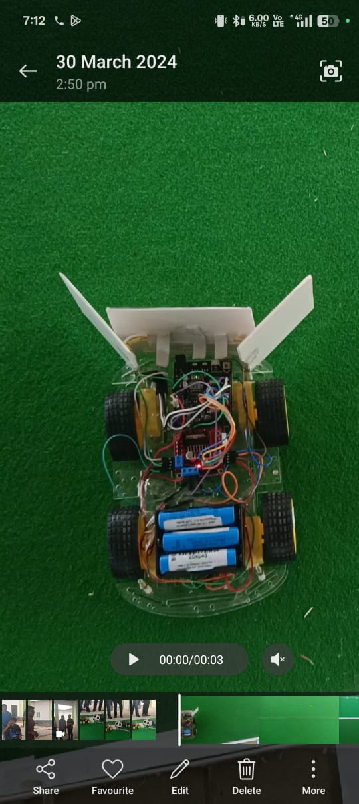
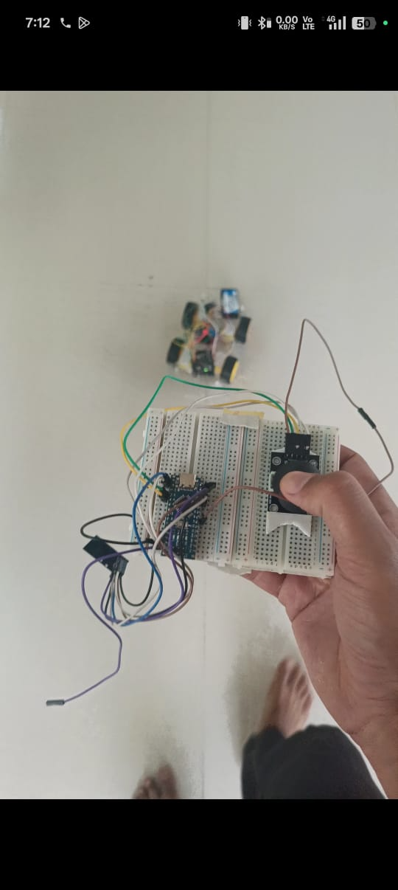

Below is a detailed `README.md` script for your Arduino-based RC car project, incorporating the hardware components, software requirements, and procedure for implementation. I'll also reference the images you provided as part of the documentation.

---

# Arduino RC Car with Bluetooth Control and Obstacle Detection

This project involves building a Bluetooth-controlled RC car using an Arduino UNO, capable of transmitting and receiving signals via an HC-05 Bluetooth module. The car is equipped with an ultrasonic sensor for obstacle detection, a buzzer for alerts, and LEDs to indicate movement permissions. The car chassis includes a front ball bearing and two rear wheels driven by battery-operated DC motors, controlled via an L293D motor driver IC.

## Project Overview

The RC car can be controlled remotely through a Bluetooth connection (e.g., via a smartphone app). It uses an ultrasonic sensor to detect obstacles and alerts the user with a buzzer if an obstacle is too close. Two LEDs (red and green) indicate whether the car is safe to move (green) or should stop (red). The project is built using an Arduino UNO, with all components connected via a breadboard.

## Hardware Components Required

- **Arduino UNO with PC Connector Cable**: The microcontroller board to control the RC car.
- **Chassis**: A chassis with a front ball bearing for steering and two rear wheels for movement.
- **L293D Motor Driver IC (or L298N)**: Used to control the two DC motors.
- **HC-05 Bluetooth Module**: For wireless communication between the car and the controller (e.g., a smartphone).
- **Ultrasonic Sensor (HC-SR04)**: For obstacle detection.
- **Two Battery-Operated (BO) DC Motors**: To drive the rear wheels of the car.
- **Buzzer**: To alert when an obstacle is detected.
- **Breadboard**: For making connections between components.
- **Red LED and Green LED**: To indicate movement permissions (green for safe, red for stop).
- **Jumper Wires and Miscellaneous**: For connections and additional components like resistors for LEDs.
- **Power Supply**: Battery pack to power the motors and Arduino.

## Software Needed

- **Arduino IDE**: To write, compile, and upload the code to the Arduino UNO.

## Wiring Diagram

Below is the wiring diagram for the RC car, as referenced from the provided schematic image:


### Connections Explained:
1. **Arduino UNO**:
   - Connected to the PC via a USB cable for programming.
   - Powers the HC-05 Bluetooth module, ultrasonic sensor, buzzer, and LEDs.
2. **HC-05 Bluetooth Module**:
   - Connected to the Arduino's RX (pin 0) and TX (pin 1) for serial communication.
   - VCC to 5V, GND to GND.
3. **Ultrasonic Sensor (HC-SR04)**:
   - VCC to 5V, GND to GND.
   - Trig pin to Arduino digital pin 8, Echo pin to Arduino digital pin 9.
4. **L293D Motor Driver**:
   - Controls the two DC motors.
   - Input pins connected to Arduino digital pins 3, 4, 5, and 6.
   - Motor outputs connected to the two DC motors.
   - VCC to battery supply, GND to GND.
5. **DC Motors**:
   - Connected to the L293D motor driver outputs.
6. **Buzzer**:
   - Connected to Arduino digital pin 10.
7. **Red and Green LEDs**:
   - Red LED connected to Arduino digital pin 11 (with a resistor).
   - Green LED connected to Arduino digital pin 12 (with a resistor).

## Procedure for Implementation

1. **Assemble the Chassis**:
   - Attach the two DC motors to the rear wheels of the chassis.
   - Ensure the front ball bearing allows for smooth steering.

2. **Set Up the Breadboard**:
   - Place the L293D motor driver IC on the breadboard.
   - Connect the Arduino UNO, HC-05 Bluetooth module, ultrasonic sensor, buzzer, and LEDs to the breadboard as per the wiring diagram.

3. **Connect the Components**:
   - Follow the wiring diagram to connect all components using jumper wires.
   - Double-check connections to avoid short circuits.

4. **Power the System**:
   - Connect the battery pack to power the motors and Arduino.
   - Ensure the Arduino is also connected to the PC via the USB cable for programming.

5. **Write the Code**:
   - Use the Arduino IDE to write the code for the RC car. The code should:
     - Receive commands via the HC-05 Bluetooth module.
     - Control the DC motors using the L293D motor driver.
     - Read distance data from the ultrasonic sensor.
     - Activate the buzzer and LEDs based on obstacle detection.
   - See the `Code` section below for the sample code.

6. **Upload the Code**:
   - Upload the code to the Arduino UNO using the Arduino IDE.

7. **Test the RC Car**:
   - Pair the HC-05 Bluetooth module with your smartphone or controller.
   - Use a Bluetooth terminal app to send commands (e.g., 'F' for forward, 'B' for backward, 'L' for left, 'R' for right, 'S' for stop).
   - Test the obstacle detection: the buzzer should sound, and the red LED should light up when an obstacle is detected within a set distance (e.g., 20 cm). The green LED should light up when the path is clear.

## Code

Below is a sample Arduino sketch for the RC car:

```cpp
// Pin definitions
#define TRIG_PIN 8
#define ECHO_PIN 9
#define BUZZER_PIN 10
#define RED_LED 11
#define GREEN_LED 12
#define MOTOR_PIN1 3
#define MOTOR_PIN2 4
#define MOTOR_PIN3 5
#define MOTOR_PIN4 6

// Variables
long duration;
int distance;
char command;

void setup() {
  // Initialize serial communication for Bluetooth
  Serial.begin(9600);

  // Set pin modes
  pinMode(TRIG_PIN, OUTPUT);
  pinMode(ECHO_PIN, INPUT);
  pinMode(BUZZER_PIN, OUTPUT);
  pinMode(RED_LED, OUTPUT);
  pinMode(GREEN_LED, OUTPUT);
  pinMode(MOTOR_PIN1, OUTPUT);
  pinMode(MOTOR_PIN2, OUTPUT);
  pinMode(MOTOR_PIN3, OUTPUT);
  pinMode(MOTOR_PIN4, OUTPUT);

  // Initial state
  digitalWrite(RED_LED, LOW);
  digitalWrite(GREEN_LED, HIGH);
}

void loop() {
  // Read distance from ultrasonic sensor
  digitalWrite(TRIG_PIN, LOW);
  delayMicroseconds(2);
  digitalWrite(TRIG_PIN, HIGH);
  delayMicroseconds(10);
  digitalWrite(TRIG_PIN, LOW);
  duration = pulseIn(ECHO_PIN, HIGH);
  distance = duration * 0.034 / 2;

  // Check for obstacles
  if (distance < 20) { // If obstacle is closer than 20 cm
    digitalWrite(BUZZER_PIN, HIGH);
    digitalWrite(RED_LED, HIGH);
    digitalWrite(GREEN_LED, LOW);
    stopMotors(); // Stop the car
  } else {
    digitalWrite(BUZZER_PIN, LOW);
    digitalWrite(RED_LED, LOW);
    digitalWrite(GREEN_LED, HIGH);
  }

  // Check for Bluetooth commands
  if (Serial.available() > 0) {
    command = Serial.read();
    switch (command) {
      case 'F': // Forward
        if (distance >= 20) {
          moveForward();
        }
        break;
      case 'B': // Backward
        moveBackward();
        break;
      case 'L': // Left
        if (distance >= 20) {
          turnLeft();
        }
        break;
      case 'R': // Right
        if (distance >= 20) {
          turnRight();
        }
        break;
      case 'S': // Stop
        stopMotors();
        break;
    }
  }
}

// Motor control functions
void moveForward() {
  digitalWrite(MOTOR_PIN1, HIGH);
  digitalWrite(MOTOR_PIN2, LOW);
  digitalWrite(MOTOR_PIN3, HIGH);
  digitalWrite(MOTOR_PIN4, LOW);
}

void moveBackward() {
  digitalWrite(MOTOR_PIN1, LOW);
  digitalWrite(MOTOR_PIN2, HIGH);
  digitalWrite(MOTOR_PIN3, LOW);
  digitalWrite(MOTOR_PIN4, HIGH);
}

void turnLeft() {
  digitalWrite(MOTOR_PIN1, LOW);
  digitalWrite(MOTOR_PIN2, HIGH);
  digitalWrite(MOTOR_PIN3, HIGH);
  digitalWrite(MOTOR_PIN4, LOW);
}

void turnRight() {
  digitalWrite(MOTOR_PIN1, HIGH);
  digitalWrite(MOTOR_PIN2, LOW);
  digitalWrite(MOTOR_PIN3, LOW);
  digitalWrite(MOTOR_PIN4, HIGH);
}

void stopMotors() {
  digitalWrite(MOTOR_PIN1, LOW);
  digitalWrite(MOTOR_PIN2, LOW);
  digitalWrite(MOTOR_PIN3, LOW);
  digitalWrite(MOTOR_PIN4, LOW);
}
```

## Photos of the Project

### Assembled RC Car
Below is an image of the assembled RC car, showing the chassis, motors, and components:


### RC Car in Action
Here is the RC car on a green surface, ready for testing:



### Breadboard Setup
The breadboard setup with the Arduino UNO and components:



## Troubleshooting

- **Bluetooth Not Connecting**: Ensure the HC-05 module is paired with your device and the baud rate matches (default is 9600).
- **Motors Not Moving**: Check the connections to the L293D motor driver and ensure the battery pack is supplying sufficient voltage.
- **Ultrasonic Sensor Not Working**: Verify the Trig and Echo pin connections and ensure there are no loose wires.
- **Buzzer/LEDs Not Responding**: Check the pin assignments in the code and ensure the components are connected to the correct pins.

## Future Enhancements

- Add a camera module for live video streaming.
- Implement more advanced obstacle avoidance algorithms.
- Use a mobile app with a custom interface for better control.

## License

This project is licensed under the MIT License - feel free to use and modify it as needed.

---

This `README.md` provides a comprehensive guide for your Arduino RC car project, including hardware setup, wiring, code, and references to the provided images. Let me know if you'd like to adjust or add more details!
